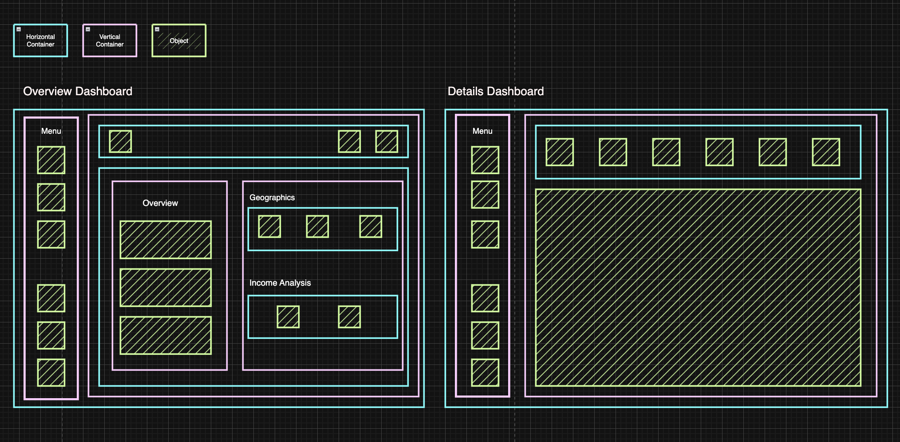

# 📊 TalentPulse: HR Analytics Dashboard  

End-to-End HR Data Analytics Solution — from planning to insights.  

---

## 🚀 Project Overview  
This project is a **professional HR Analytics Case Study** designed to showcase how data can drive smarter decisions in workforce management. From **strategic planning** to **dashboard design**, it demonstrates my ability to:  
- Organize and plan projects (via Notion).  
- Design dashboard mockups (via Draw.io).  
- Build interactive dashboards (via Tableau).  
- Deliver **actionable insights** for HR and business leaders.  

---

## 📊 Business Problem & Goal  
Modern HR teams face challenges in understanding workforce dynamics:  
- How do demographics and education levels affect performance?  
- Where are hiring/termination trends happening?  
- What’s the relationship between age, role, and salary?  

👉 **Goal:** Build an interactive HR dashboard to provide leaders with clarity on workforce demographics, income distribution, and retention patterns.  

---

## 🛠️ Tools & Skills Gained  
- **Tableau** – data visualization, calculated fields, dashboard building  
- **Notion** – project planning, timelines, architecture documentation  
- **Draw.io** – mockup & container design  
- **Figma** – UI/UX considerations  
- **Data Modeling & Storytelling** – structuring analytics to answer real business questions  

---

## 🗂️ Project Planning  
📌 View the complete planning and architecture in **Notion**:  
[🔗 Project Planning on Notion](https://www.notion.so/Tableau-HR-Dashboard-25c56170e5f2802fae80cae7bd8b97b8?source=copy_link)  

---

## 🎨 Mockups  
Wireframed in **Draw.io** before implementation:  

  

---

## 📈 Dashboards  

### 🔹 Summary Dashboard  
  

### 🔹 Detail Dashboard  
 

👉 [**View Live Interactive Dashboard on Tableau Public**](https://public.tableau.com/views/HROverviewDashboard_17562573699270/HRSummary?:language=en-US&:sid=&:redirect=auth&:display_count=n&:origin=viz_share_link)  

---

## 🔑 Key Insights  
From the HR dashboards, decision-makers can uncover insights such as:  
1. **Hiring vs Termination Trends** — Monitor retention health.  
2. **Education & Performance** — Identify how higher education correlates with stronger performance.  
3. **Demographics Breakdown** — Understand workforce gender balance and age groups.  
4. **Age vs Salary** — Spot compensation trends across different roles and experience levels.  

---

## ☕ About Me

Hi! I’m **Palak Gupta**, a Mathematics–Computer Science student with a deep interest in data analytics, business intelligence, and data engineering. I enjoy building real-world projects that combine technical skill with business insight, using tools like SQL, Docker, Notion, and automation platforms like n8n.

📫 **Let’s connect**:  
- 🔗 [LinkedIn](https://www.linkedin.com/in/palakgupta28/)  
- 📧 [palakgupta0428@gmail.com](mailto:palakgupta0428@gmail.com)  

---
